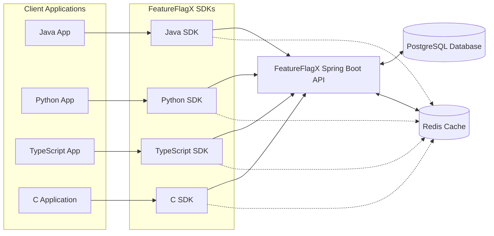

# FeatureFlagX: Universal Feature-Flag Service & SDK

FeatureFlagX is a comprehensive feature flagging solution designed to empower development teams to safely roll out new features, conduct A/B tests, and manage application functionality without requiring redeployments. This project provides a robust Java Spring Boot HTTP API for managing and evaluating feature flags, with durable storage via PostgreSQL and a high-performance evaluation cache using Redis. It also includes client SDKs for various languages to integrate feature flagging capabilities seamlessly into different application environments.

## 1. Purpose & Use Case

Feature toggles (or feature flags) are a powerful technique that allows teams to modify system behavior without changing code and/or redeploying. FeatureFlagX aims to provide a centralized and easy-to-use service for this purpose.

**Key use cases include:**
- **Safe Rollouts:** Gradually release new features to a subset of users before a full rollout.
- **A/B Testing:** Test different versions of a feature with different user segments.
- **Kill Switches:** Quickly disable problematic features in production without a rollback.
- **Trunk-Based Development:** Allow developers to merge code to the main branch more frequently, with new features hidden behind flags until ready.

**Target Consumers:**
- Microservices (e.g., Java, Python) needing to toggle endpoints or backend logic.
- Frontend/SSR applications (e.g., TypeScript) for UI experiments and conditional rendering.
- Embedded or performance-sensitive systems (e.g., C) requiring lightweight flag evaluation.

## 2. Tech Stack

| Layer              | Technology                                      |
|--------------------|-------------------------------------------------|
| API Service        | Java 17 + Spring Boot                           |
| Persistence        | PostgreSQL (via Spring Data JPA)                |
| Cache / Eval Store | Redis (via Spring Data Redis)                   |
| SDKs / Clients     | Java (Maven), Python (pip), TypeScript (npm), C |
| Deployment         | Docker, Docker Compose (Kubernetes optional)    |
| CI/CD (Conceptual) | GitHub Actions                                  |
| Monitoring         | Prometheus + Grafana (via Spring Boot Actuator) |

## 3. High-Level Design

The system consists of a central API service and client SDKs.



**Flag CRUD Operations:**
- `POST /flags`, `PUT /flags/{key}`, `DELETE /flags/{key}`
- The API Controller delegates to a Service layer.
- The Service layer writes to PostgreSQL via Spring Data JPA.
- The Service layer invalidates the corresponding Redis cache entry (e.g., `DELETE flag:{key}`).

**Flag Evaluation:**
- `GET /evaluate/{key}?targetId={target}`
- The Service layer first attempts to retrieve the flag's state from Redis.
- On a cache miss, it loads the flag from PostgreSQL, populates the Redis cache with a Time-To-Live (TTL), and then returns the state.

**Client SDKs:**
- Wrap HTTP calls to the FeatureFlagX API.
- Implement local in-process caching (e.g., using Caffeine for Java SDK) to reduce latency and API load.
- Provide a simple interface, such as `FeatureFlagClient.isEnabled(flagKey, targetId, defaultValue)`.

## 4. Project File Structure

```
featureflagx/
├── README.md
├── docker-compose.yml
├── api/
│   ├── pom.xml
│   ├── src/
│   │   ├── main/
│   │   │   ├── java/com/featureflagx/
│   │   │   │   ├── Application.java
│   │   │   │   ├── config/           # DataSourceConfig.java, RedisConfig.java
│   │   │   │   ├── controller/       # FlagController.java
│   │   │   │   ├── model/            # Flag.java (JPA Entity)
│   │   │   │   ├── repository/       # FlagRepository.java
│   │   │   │   ├── service/          # FlagService.java
│   │   │   │   └── dto/              # FlagRequest.java, FlagResponse.java
│   │   │   └── resources/
│   │   │       └── application.yml
│   │   └── test/
│   │       └── java/com/featureflagx/  # FlagServiceTest.java, FlagControllerTest.java
│   └── Dockerfile
├── sdk-java/
│   ├── pom.xml
│   └── src/main/java/com/featureflagx/sdk/
│       └── FeatureFlagClient.java
├── sdk-python/               # Python SDK
├── sdk-ts/                   # TypeScript SDK
└── sdk-c/                    # Placeholder for C SDK
    └── README.md
```

## 5. Setup and Running the API Service

**Prerequisites:**
- Docker and Docker Compose
- Java 17+ and Maven (for building the API from source or developing)

**Using Docker Compose (Recommended):**
1.  **Clone the repository.**
2.  **Navigate to the `featureflagx` directory.**
3.  **Environment Variables:**
    The `docker-compose.yml` and `api/src/main/resources/application.yml` are configured to use environment variables for sensitive information like database credentials. You can set these variables in your environment or create a `.env` file in the `featureflagx` root directory with the following content:
    ```env
    # .env file (example)
    DB_USER=admin
    DB_PASSWORD=securepassword123
    DB_NAME=featureflags
    # REDIS_PASSWORD=yourredispassword # Uncomment if you set a password for Redis
    ```
    If a `.env` file is not used, default values from `docker-compose.yml` or `application.yml` will be attempted.
4.  **Build and Run:**
    ```bash
    docker-compose up --build
    ```
    This command will build the API Docker image (if not already built) and start the API service, PostgreSQL database, and Redis cache.
    The API will be accessible at `http://localhost:8080`.

**Building and Running Manually (for development):**
1.  **Start PostgreSQL and Redis:** You can use the provided `docker-compose.yml` to start only the database and cache:
    ```bash
    docker-compose up -d db redis
    ```
    Ensure the connection details in `api/src/main/resources/application.yml` match your setup (or are overridden by environment variables).
2.  **Build the API:**
    Navigate to the `api/` directory:
    ```bash
    cd api
    mvn clean package
    ```
3.  **Run the API:**
    ```bash
    java -jar target/api-0.1.0.jar 
    # You might need to set Spring profiles or environment variables for DB/Redis connection
    # e.g., SPRING_DATASOURCE_URL=jdbc:postgresql://localhost:5432/ffx ...
    ```

## 6. API Endpoints

-   `POST /flags`: Create a new feature flag.
    -   Request Body: `FlagRequest` JSON (`{ "key": "my-new-feature", "enabled": true, "config": "{\"version\": \"v1\"}" }`)
-   `PUT /flags/{key}`: Update an existing feature flag.
    -   Request Body: `FlagRequest` JSON
-   `DELETE /flags/{key}`: Delete a feature flag.
-   `GET /flags/{key}`: Retrieve a specific feature flag.
-   `GET /flags`: Retrieve all feature flags.
-   `GET /flags/evaluate/{key}?targetId={targetId}`: Evaluate a feature flag. Returns `true` or `false`.
    -   `targetId` is optional and can be used for more complex targeting rules in future enhancements.

## 7. Java SDK Usage

Refer to the `sdk-java/README.md` (to be created) for detailed usage instructions for the Java SDK.

**Basic Example:**
```java
// In your Java application
FeatureFlagClient.Config sdkConfig = FeatureFlagClient.Config.builder()
    .apiBaseUrl("http://localhost:8080") // URL of your FeatureFlagX API
    .build();
FeatureFlagClient client = new FeatureFlagClient(sdkConfig);

String flagKey = "new-checkout-flow";
String userId = "user-12345";
boolean isEnabled = client.isEnabled(flagKey, userId, false); // false is the default value

if (isEnabled) {
    // Show new checkout flow
} else {
    // Show old checkout flow
}
```

## 8. Other SDKs (Python, TypeScript, C)

SDKs (`sdk-python/`, `sdk-ts/`) and a placeholder for (`sdk-c/`) are included in the project. SDK-C is intended to be developed in the future. Each SDK directory contains/will contain its own `README.md` with specific usage instructions.

## 9. CI/CD

A basic CI/CD pipeline has been set up using GitHub Actions. Workflow (`.github/workflows/main.yml`) includes the following steps:

1.  **Checkout Code:** Checks out the repository.
2.  **Set up JDK:** Initializes the Java environment.
3.  **Build API:** Compiles the Spring Boot API and runs tests (`mvn clean package` or `mvn verify` in the `api/` directory).
4.  **Build SDKs:** Compiles and tests each SDK (e.g., `mvn test` for `sdk-java/`).
5.  **Build Docker Image:** Builds the Docker image for the API service.
6.  **Push Docker Image:** Pushes the built image to a container registry (e.g., Docker Hub, GitHub Container Registry).
7.  **Publish SDKs:** Publishes SDK artifacts to package repositories (e.g., Maven Central for Java, PyPI for Python, npm for TypeScript).

**Example `.github/workflows/main.yml`:**
```yaml
name: FeatureFlagX CI

on:
  push:
    branches: [ main ]
  pull_request:
    branches: [ main ]

jobs:
  build-and-test-api:
    runs-on: ubuntu-latest
    steps:
    - uses: actions/checkout@v3
    - name: Set up JDK 17
      uses: actions/setup-java@v3
      with:
        java-version: '17'
        distribution: 'temurin'
        cache: maven

    - name: Build and Test API with Maven
      working-directory: ./api
      run: mvn -B verify --file pom.xml

    # Add steps for Docker build and push if needed
    # - name: Build and push Docker image
    #   uses: docker/build-push-action@v2
    #   with:
    #     context: ./api
    #     push: ${{ github.event_name == 'push' && github.ref == 'refs/heads/main' }}
    #     tags: your-docker-repo/featureflagx-api:latest
```


